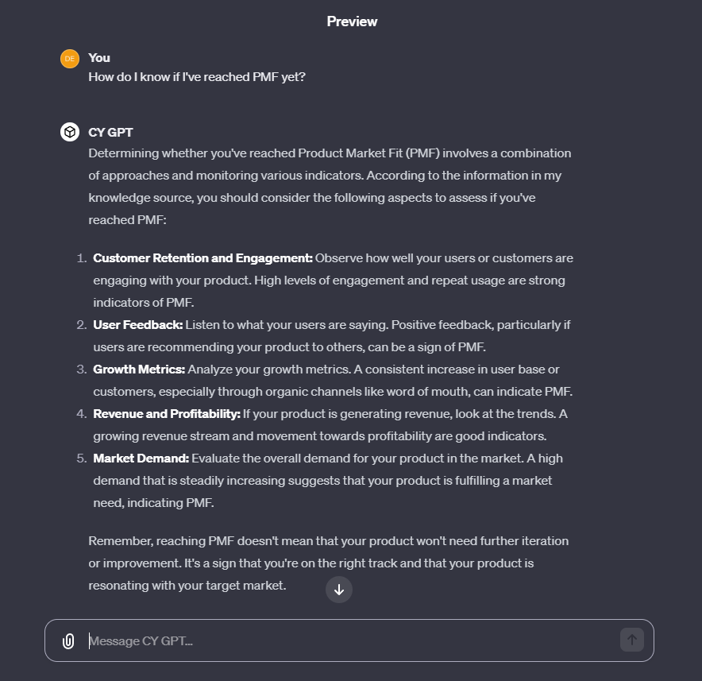
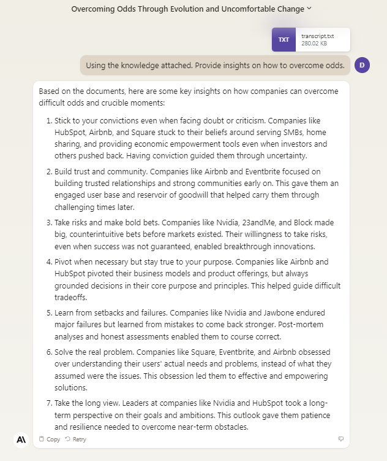

# CY GPT


<p align="center">

</p>

_This project is designed to make it more efficient to collate data from a Youtube Channel to create custom GPTs, train models or for use in querying a large context window (i.e: with Anthropic's Claude 2.1's 200k Token length)_

**Asking for approval before you do this is probably a good idea**

*<p align="center">The below example is strictly for research purposes</p>*

### Example

The default example is based on a prolific startup accelerator, we'll call them "**C Yombinator**".

Their Youtube channel is filled with boundless insight on running a startup and learning how to "make it" in the tech startup industry!

But their time is very limited and unless you are accepted into their accelerator it will be very difficult to seek advice from them.

Here is where CY GPT comes into play, using the information acquired from the channels Youtube transcripts we can use that data and a bit of prompt engineering to create a custom GPT that will help make our startup tech dreams come true ✨🎉

(in theory...)

### Output Examples

#### Custom GPT by OpenAi

<p align="center">

</p>


#### Claude 2.1 Context Window

<p align="center">

</p>

### Setup

1. Install python

2. Head to https://developers.google.com/youtube/v3/getting-started and follow the steps to retrieve an API key for Youtube

   a) Create a .env file

   b) Add YOUTUBE_API_KEY=_your YT API key_

3. pip install -r ./requirements

### Running

1. python ./src/retrieval.py - this will retrieve all the Youtube Video Ids and store them in youtube-ids.json

2. python ./src/main.py - This will use those stored Youtube IDs to generate a complete channel transcript (if a video has subtitles enabled)

**Custom GPT via OpenAi:**

3. Head to https://chat.openai.com/gpts/discovery

4. Create a GPT

5. In the Configure tab within the "Knowledge" section, upload your retrieved transcript

6. Update the **Instructions** section with a custom prompt

Example Prompt:

```
Based on your knowledge base provide detailed and helpful advice to answer a users query.
```

7. Use your newly created custom GPT!

**Context Window via Claude 2.1 by Anthropic**

3. Head to https://claude.ai/chats

4. Drag n drop OR paste in your data to the input

5. Ask questions about if your company has reached PMF yet (hint: it hasn't...sad face)
